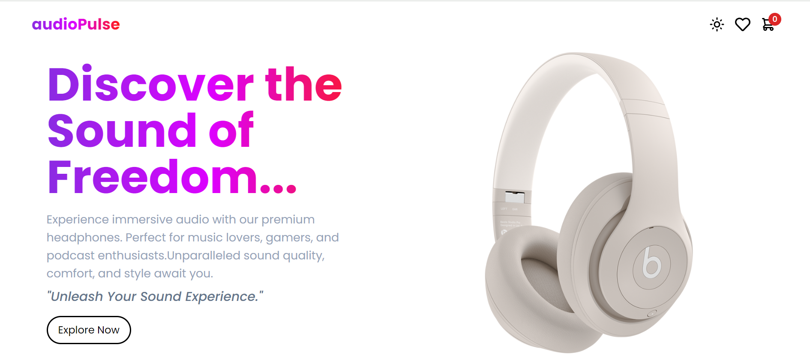

# audioPulse :) E-commerce Shopping App

## Preview

## Cart Preview

## Overview

audioPulse is a modern e-commerce shopping app built using React.js. It provides a platform for users to browse and purchase the latest headphones and audio accessories. The app features dark mode support for improved usability in low-light environments. It utilizes Context API and useReducer hook for state management, ensuring efficient and scalable data handling.

## Features

- Browse and purchase a wide range of headphones and audio accessories.
- Switch between light and dark mode for personalized user experience.
- Efficient state management using Context API and useReducer hook.
- Responsive design for seamless user experience across devices.

## Technologies Used

- React.js
- Context API
- useReducer hook
- HTML5
- CSS3 (with Tailwind CSS for styling)
- React Router DOM for navigation
- React-Icons

## Setup Instructions

1. Clone the repository:

2. Install dependencies:

3. Start the development server:

4. Open `localhost:5173` in your web browser to view the app.

## Owner

- Amandeep Singh (@ammndeep)
